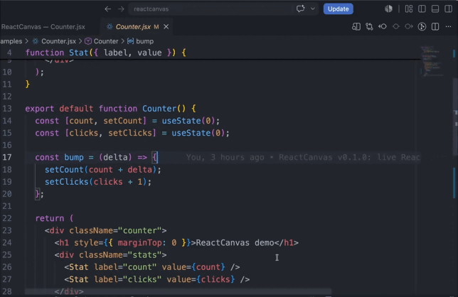

# ReactCanvas

[](https://marketplace.visualstudio.com/items?itemName=debabrata100.reactcanvas)
[](https://marketplace.visualstudio.com/items?itemName=debabrata100.reactcanvas)
[](https://open-vsx.org/extension/debabrata100/reactcanvas)
[](LICENSE)

A live React playground and preview for `.jsx` / `.tsx` files, right inside VS Code. No dev server, no project build setup — open a component file and see it render.

## Install

**[Install from the VS Code Marketplace](https://marketplace.visualstudio.com/items?itemName=debabrata100.reactcanvas)** — or search for “ReactCanvas” in the Extensions view (`Ctrl+Shift+X` / `Cmd+Shift+X`), or from the command line:

```bash
code --install-extension debabrata100.reactcanvas
```

Also available on [Open VSX](https://open-vsx.org/extension/debabrata100/reactcanvas) for VSCodium, Gitpod, and other VS Code-compatible editors.



I built this because I got tired of spinning up a whole Vite project just to check what one component looks like. Open the file, hit preview, done.

## Features

| Feature | Details |
| --- | --- |
| Live preview | `ReactCanvas: Open Preview` opens a panel beside your editor |
| In-memory transpile | esbuild-wasm (with automatic `@babel/standalone` fallback) — no Node child processes, no bundler config |
| Live reload | Re-renders ~300 ms after you stop typing |
| React version selector | Switch between React 17, 18, and 19 (`ReactCanvas: Select React Version`), loaded from esm.sh via import maps; persisted per workspace and shown in the status bar |
| Error overlay | Transpile errors (with line numbers) and runtime errors shown in the preview, not just the console |
| Hooks & multiple components | `useState`, `useEffect`, etc. work out of the box; the default export is rendered as the root |
| CSS support | Inline styles, plus a same-name `.css` file next to your component is injected automatically (`Button.jsx` → `Button.css`) |
| Theme aware | Preview chrome follows your VS Code light/dark theme |
| Secure by design | Strict CSP with nonces; user code runs only inside a sandboxed iframe |

## Usage

1. Open a `.jsx` or `.tsx` file with a default export:

   ```jsx
   export default function App() {
     const [count, setCount] = React.useState(0);
     return <button onClick={() => setCount(count + 1)}>Clicked {count}×</button>;
   }
   ```

2. Run **ReactCanvas: Open Preview** from the Command Palette (or the editor title button).
3. Edit — the preview reloads as you type.
4. Click the React version badge (in the preview toolbar or status bar) to switch React versions.

> The preview loads React from [esm.sh](https://esm.sh), so it needs network access.

## Requirements

None. No local React install, no build configuration.

## Known limitations

- Only the active file is compiled: relative imports of other modules (`./utils`) are not resolved yet (see Roadmap).
- npm package imports other than `react` / `react-dom` are not mapped.
- Runtime error stack traces reference compiled code, not original source lines.

## Roadmap

- **v2: multi-file import resolution** — follow relative imports (`./Button`, `../hooks/useThing`) and bundle them into the preview.
- Import maps for arbitrary npm packages via esm.sh.
- Source-mapped runtime stack traces.
- Prop playground / knobs for the root component.

## Development

```bash
npm install
npm run watch        # rebuild on change; F5 in VS Code to launch the extension host
npm test             # lint-free unit + integration tests
npm run package      # build a .vsix
```

## License

[MIT](LICENSE)
